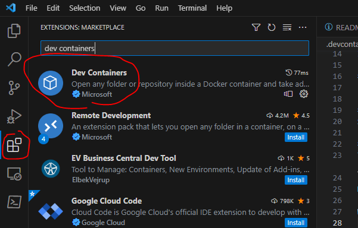
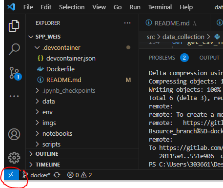
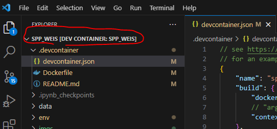
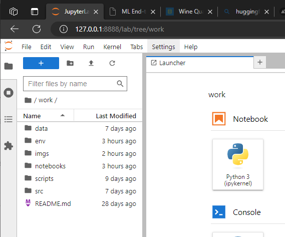

# Docker set up

## Introduction
We can use Docker desktop on our windows lap tops to ensure a consistent development environment between developers and their machines.  The Docker container can be integrated with VS Code or it can start up jupyter lab.  

## Installation instructions
In order to use Docker on a Windows machine follow these steps in order.

### Install WSL
In power shell run `wsl --install`. Instructions: https://learn.microsoft.com/en-us/windows/wsl/install

### Install Docker Desktop
Follow the instructions for installation using the WSL 2 backend: https://docs.docker.com/desktop/install/windows-install/

### Install Dev Containers extension in VS Code

### Set up `.devcontainer` directory
This directory will contain our `Dockerfile` and `devcontainer.json` which includes options for building and launching the container. See a fully worked example setting up a `.devcontainer` directory for use with VS Code here: https://github.com/RamiKrispin/vscode-python.  

### Jupyter lab docker
The Jupyter project maintains containers that can be used to launch notebooks, see their documentation: https://jupyter-docker-stacks.readthedocs.io/en/latest/using/selecting.html

Here are their available containers:  https://hub.docker.com/u/jupyter

We can use these as base containers and extend them as needed in the Dockerfile.

## Intructions for use

### VS Code
To open VS Code in the container select the dev container widget at the bottom left of VS Code and select `Reopen in Container` from the drop down at the top of the screen.

This will start a container and open VS Code inside that container from the project root.

To exit VS Code in the container select the dev container widget at the bottom left of VS Code and select `Reopen in folder` from the drop down at the top of the screen.

### Jupyter lab
To use jupyter lab we need to follow these steps to build the container:
1. From project root `cd .devcontainer`
2. Build container `docker build . -f Dockerfile -t spp_weis:latest --progress=plain`

The container only needs to be built once or rebuilt if there are changes.  Once it's built we can lauch a container running jupyter lab using these steps:
1. From the project root run `docker run -it --gpus all --rm  -p 8888:8888 -v ${PWD}:/home/jovyan/work --name spp_weis -d spp_weis:latest`. This will start an interactive container with the project root (`${PWD}`) mapped to the `/home/jovyan/work` directory in the container.  Docker does note use the gpu by default, adding `--gpus all` gives the container access to the gpu.
2. Access the container throug this link: http://127.0.0.1:8888/lab?token=spp_weis. Token is set in the `devcontainer.json` file in the `"postCreateCommand": "jupyter-lab --ServerApp.token=spp_weis"` line.
3. Once you are finished using the container it can be shut down with `docker stop spp_weis`.  Running containers can be viewed with `docker ps`.

