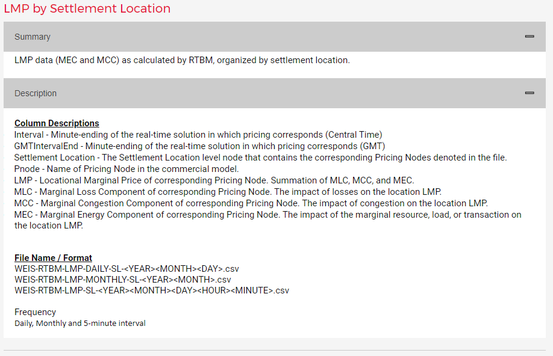
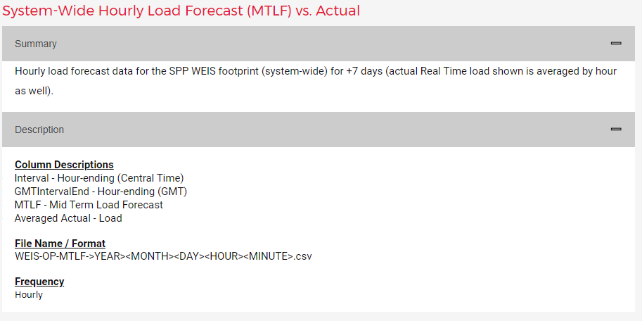
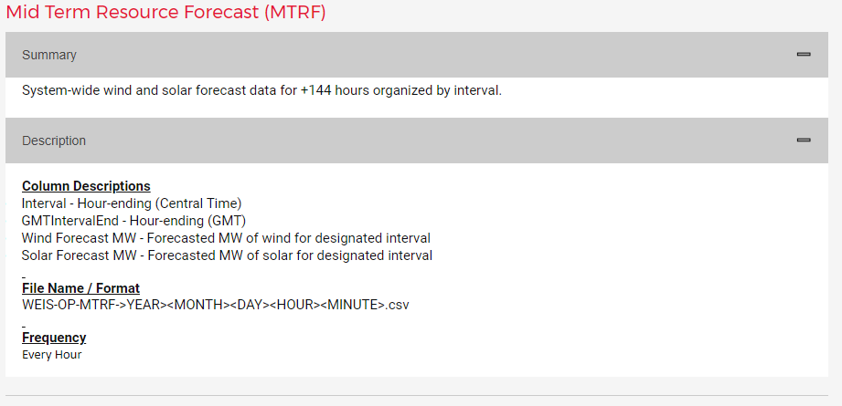
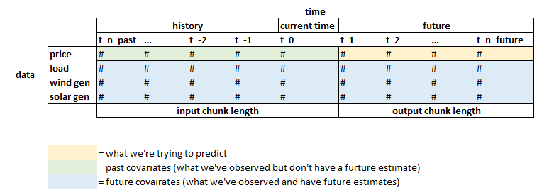

# SPP WEIS Price Forecast

## Introduction
This project forecasts SPP WEIS (Western Energy Imbalance Service) locational marginal prices using deep learning ensemble models. It implements a full MLOps lifecycle using Modal for serverless compute:

* Automated data collection from SPP
* Feature engineering with Polars and DuckDB
* Model training with Darts (TiDE, TSMixer, TFT)
* Ensemble model serving via a Shiny web app

## Architecture

```
SPP Portal (public CSV data)
    |
    v
Data Collection (Modal Jobs, S3 parquet)
    |
    v
Data Engineering (DuckDB + Polars)
    |
    v
Model Training (Darts - TiDE, TSMixer, TFT ensemble)
    |
    v
Shiny Web App (interactive forecasts with confidence intervals)
```

## Data

SPP market data is available at https://marketplace.spp.org/groups/operational-data-weis. This data is public and updated on regular intervals. Automated Modal jobs collect and upsert this data to S3.

### Data types collected

* **LMP** - Locational marginal prices for settlement locations ([source](https://marketplace.spp.org/pages/lmp-by-settlement-location-weis)). 5-minute interval data aggregated to hourly. This is the forecast target.\


* **MTLF** - Mid-term load forecast ([source](https://marketplace.spp.org/pages/systemwide-hourly-load-forecast-mtlf-vs-actual-weis)). System-wide hourly load forecast for the next 7 days (168 hours), updated every hour. Includes actuals for model training.\


* **MTRF** - Mid-term resource forecast ([source](https://marketplace.spp.org/pages/mid-term-resource-forecast-mtrf-weis)). System-wide hourly wind and solar generation forecast for the next 144 hours, updated every hour.\


## Forecasting

The [Darts](https://unit8co.github.io/darts/README.html) library provides a consistent interface to multiple forecasting models. The project trains three model types and combines them into a `NaiveEnsembleModel`:

* **TiDE** - Temporal Imputation using Deep Embeddings
* **TSMixer** - Time Series Mixer
* **TFT** - Temporal Fusion Transformer

Key parameters (see `src/parameters.py`):
* Forecast horizon: 120 hours (5 days)
* Input chunk length: 168 hours (7 days)
* Top 3 models per type are ensembled

### Data format


Historical and future covariates are declared in the fit function. Input and output chunk lengths are declared in the constructors.


## Project structure

```
├── app.py                    # Shiny web app
├── pyproject.toml            # Python dependencies
├── modal_jobs/
│   ├── data_collection.py    # Scheduled data collection (hourly + daily)
│   └── model_retrain.py      # Scheduled model retraining (weekly, GPU)
├── src/
│   ├── data_collection.py    # ETL functions for SPP data
│   ├── data_engineering.py   # Feature engineering, train/test splits
│   ├── modeling.py           # Model training (TiDE, TSMixer, TFT)
│   ├── parameters.py         # Hyperparameters and configuration
│   ├── plotting.py           # Forecast visualization
│   └── utils.py              # S3 and utility functions
├── notebooks/
│   ├── data_collection/      # Data collection notebooks
│   ├── model_training/       # Model training and tuning notebooks
│   └── app/                  # App testing notebooks
└── deprecated/               # Archived Databricks config and old Streamlit app
```

## Modal jobs

All scheduled jobs run on [Modal](https://modal.com), a serverless Python platform with pay-per-second pricing. This replaced Databricks, which was expensive for simple single-node data collection and training jobs.

| Job | File | Resources | Schedule | Description |
|-----|------|-----------|----------|-------------|
| `collect_hourly` | `modal_jobs/data_collection.py` | 16 CPU, 4 GiB | Every 6 hours | Collects MTLF, MTRF, 5-min LMP data |
| `collect_daily` | `modal_jobs/data_collection.py` | 16 CPU, 4 GiB | Every 3 days | Collects daily LMP settlement data |
| `model_retrain_weekly` | `modal_jobs/model_retrain.py` | 8 CPU, 32 GiB, A10G GPU | Sundays 8 PM UTC | Retrains ensemble model |

AWS credentials are stored in a Modal secret named `aws-secret`.

### Deploying Modal jobs

```bash
# Install Modal CLI
uv tool install modal

# Authenticate
modal token new

# Test a job
modal run modal_jobs/data_collection.py::collect_hourly

# Deploy scheduled jobs
modal deploy modal_jobs/data_collection.py
modal deploy modal_jobs/model_retrain.py
```

## Databricks (deprecated)

Databricks was replaced by Modal because it was overkill for this project's workloads. All three jobs are simple single-node Python scripts, but Databricks requires a full Spark cluster per job, an always-on workspace, and an AWS VPC with NAT gateways — adding significant fixed costs ($100+/month) regardless of usage. Modal provides pay-per-second serverless execution with a free tier, making it a better fit for lightweight scheduled jobs.

The original Databricks bundle config is preserved in `deprecated/databricks.yaml` for reference.

<details>
<summary>Databricks setup (archived)</summary>

### Initial setup

```bash
databricks auth login --host <databricks workspace url>
databricks bundle validate
databricks bundle deploy --target <target workspace>
```

### Deploying updates

1. `git push` — push to GitHub
2. `databricks bundle deploy` — deploy jobs/cluster configs
3. `databricks repos update /Workspace/Users/jleighfields@gmail.com/spp_weis_price_forecast --branch main` — pull latest code into the workspace git folder

</details>

## Shiny app deployment

To generate a `manifest.json` for deploying the Shiny app to Posit Connect:

```bash
rsconnect write-manifest shiny -o -g -e app.py .
```

## Local development

The project uses Python 3.11. Dependencies are managed via `pyproject.toml` and [uv](https://docs.astral.sh/uv/).

```bash
# Create virtual environment and install dependencies
uv sync
```
