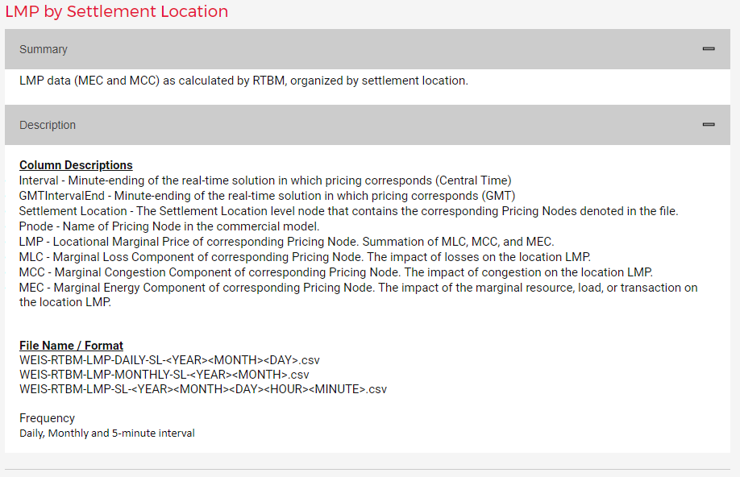
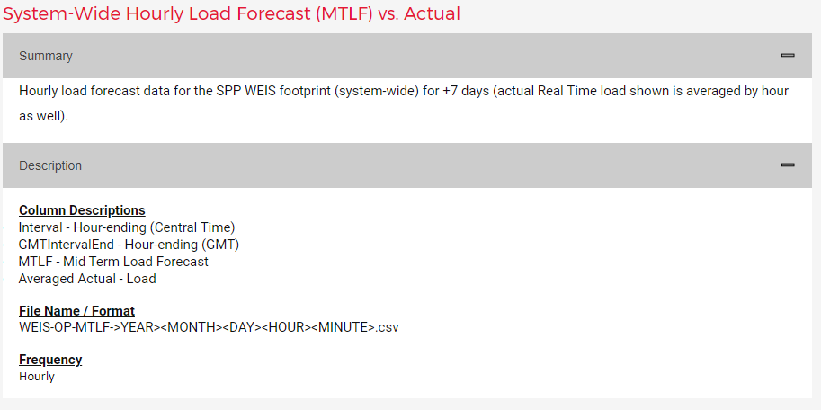
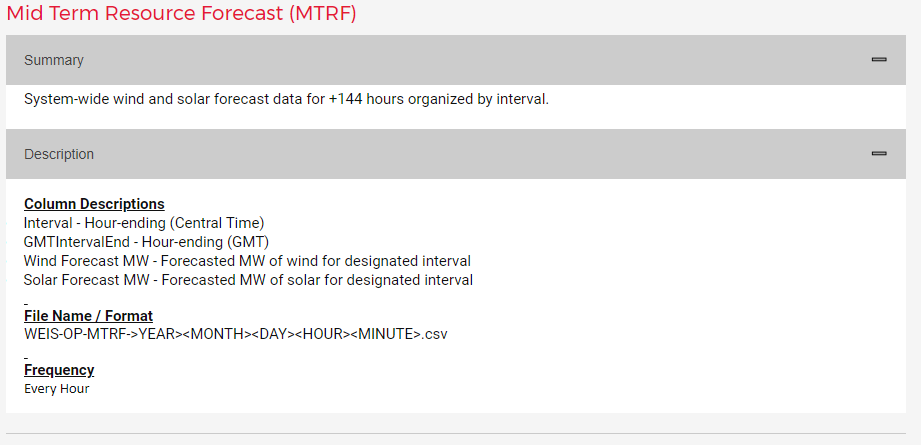
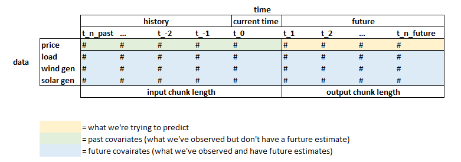

# SPP West Price Forecast

## Introduction
This project forecasts SPP West (RTO West / Integrated Marketplace) nodal
locational marginal prices using deep learning ensemble models. SPP runs the
Integrated Marketplace across two balancing authority areas — SPP East and SPP
West (`SWPW`) — and this project models the West BAA. It implements a full MLOps
lifecycle using Modal for serverless compute:

* Automated data collection from SPP
* Feature engineering with Polars and DuckDB
* Model training with Darts (TiDE, TSMixer, TFT)
* Ensemble model serving via a Shiny web app

## Architecture

```
SPP Portal (public CSV data)
    |
    v
Data Collection (Modal Jobs, R2 parquet)
    |
    v
Data Engineering (DuckDB + Polars)
    |
    v
Model Training (Darts - TiDE, TSMixer, TFT ensemble)
    |
    v
Shiny Web App (interactive forecasts with confidence intervals)
```

## Data

SPP Integrated Marketplace data is public and published on the SPP portal
(https://portal.spp.org). The feeds now carry a `BAA` column (East `SPP` /
West `SWPW`); collection filters LMP to a hub/BA node list and keeps West rows
for modeling. Automated Modal jobs collect and upsert this data to Cloudflare R2
under the `im/` prefix.

### Data types collected

* **RTBM LMP** - Real-time locational marginal prices for settlement locations ([source](https://portal.spp.org/pages/rtbm-lmp-by-location)). 5-minute interval data (plus a daily rollup) aggregated to hourly. The real-time (RT) forecast target.\


* **DA LMP** - Day-ahead locational marginal prices. Hourly cleared-auction prices per settlement location. The **primary/default** forecast target: much smoother and more autocorrelated than real-time, so far more predictable.

* **MTLF** - Mid-term load forecast ([source](https://portal.spp.org/pages/mtlf-vs-actual)). Per-BAA hourly load forecast for the next 7 days (168 hours), updated every hour. Includes actuals for model training.\


* **MTRF** - Mid-term resource forecast ([source](https://portal.spp.org/pages/midterm-resource-forecast)). Per-BAA hourly wind and solar generation forecast for the next 144 hours, updated every hour.\


## Forecasting

The [Darts](https://unit8co.github.io/darts/README.html) library provides a consistent interface to multiple forecasting models. The project trains three model types and combines them into a `NaiveEnsembleModel`:

* **TiDE** - Temporal Imputation using Deep Embeddings
* **TSMixer** - Time Series Mixer
* **TFT** - Temporal Fusion Transformer

The same pipeline trains a model per **forecast target** (`parameters.TARGETS`):
day-ahead (`da`, the default/primary) and real-time (`rt`, parked until the
market matures). Each has its own champion under `models/<target>/`, and the
Shiny app has a **Market** toggle to serve either.

Key parameters (see `src/parameters.py`):
* Forecast horizon: 120 hours (5 days)
* Input chunk length: 168 hours (7 days)
* Top 5 models per type are ensembled (`parameters.TOP_N`)

### Data format


Historical and future covariates are declared in the fit function. Input and output chunk lengths are declared in the constructors.


## Project structure

```
├── app.py                    # Shiny web app
├── pyproject.toml            # Python dependencies
├── modal_jobs/
│   ├── data_collection_im.py # Scheduled Integrated Marketplace collection (hourly + daily)
│   └── model_retrain.py      # Scheduled model retraining — day-ahead + real-time (weekly, GPU)
├── src/
│   ├── darts_wrapper.py      # Darts model wrapper for Shiny integration
│   ├── data_collection.py    # Legacy WEIS market ETL + weather upsert (WEIS feed logic; still imported by the weather notebook)
│   ├── data_collection_utils.py # Shared feed-agnostic collection helpers (used by both collectors)
│   ├── data_collection_im.py # ETL functions for the Integrated Marketplace feeds
│   ├── data_engineering.py   # Feature engineering, train/test splits
│   ├── modeling.py           # Model training and loading (TiDE, TSMixer, TFT)
│   ├── node_list.py          # Stored/modeled hub & BA settlement-location node lists
│   ├── parameters.py         # Hyperparameters and configuration
│   ├── plotting.py           # Forecast visualization
│   └── utils.py              # R2/S3 and utility functions
├── tests/
│   ├── unit/                 # Fast unit tests (no network/browser needed)
│   │   ├── fixtures/         # Trimmed real portal CSVs for the IM collector tests
│   │   ├── test_app.py       # App helper function tests
│   │   ├── test_data_collection.py
│   │   ├── test_data_collection_im.py
│   │   ├── test_data_engineering.py
│   │   ├── test_modeling_load.py
│   │   └── test_utils_s3.py
│   └── e2e/                  # Playwright browser tests (requires chromium)
│       ├── conftest.py       # Shiny app fixture
│       ├── app_for_test.py   # Lightweight app with mock data/models
│       └── test_app_e2e.py   # UI lifecycle tests
├── scripts/
│   ├── r2_move_objects.py    # R2 object move/copy/delete utility
│   └── weis_stitch_fill.py   # One-time WEIS→data_im West stitch-fill (Phase 2)
├── notebooks/                    # Marimo notebooks (.py) — run with `marimo edit` or `python`
│   ├── data_collection/      # IM collection notebooks (im_hourly/im_daily/im_backfill) + weather
│   ├── model_training/       # Model training and tuning notebooks
│   └── app/                  # App testing notebooks
└── deprecated/               # Archived Databricks config, old Streamlit app
    └── weis/                 # Retired WEIS market-collection notebooks + Modal wrapper
```

## Modal jobs

All scheduled jobs run on [Modal](https://modal.com), a serverless Python platform with pay-per-second pricing. This replaced Databricks, which was expensive for simple single-node data collection and training jobs.

Modal jobs are thin wrappers that import and run the corresponding [marimo](https://marimo.io) notebooks headlessly. This keeps one source of truth for all logic (the notebook) while Modal handles scheduling, resources, and secrets.

| Job | File | Notebook | Resources | Schedule | Est. Runtime | Description |
|-----|------|----------|-----------|----------|--------------|-------------|
| `collect_im_hourly` | `modal_jobs/data_collection_im.py` | `notebooks/data_collection/data_collection_im_hourly.py` | 16 CPU, 4 GiB | Every 4 hours | ~1 min | Collects IM MTLF, MTRF, RF reserve zone, 5-min LMP data |
| `collect_im_daily` | `modal_jobs/data_collection_im.py` | `notebooks/data_collection/data_collection_im_daily.py` | 16 CPU, 4 GiB | Every 3 days | ~1 min | Runs the daily-LMP repair sweep and collects Day-Ahead LMP data |
| `model_retrain_weekly` | `modal_jobs/model_retrain.py` | `notebooks/model_training/model_retrain.py` | 8 CPU, 32 GiB, A10G GPU | Sundays 8 PM UTC | ~15 min | Retrains ensemble model |

Runtimes are estimates based on current resource configuration. The retired WEIS
market-collection jobs and notebooks live under `deprecated/weis/` (feeds dead since
2026-04-01); `src/data_collection.py` stays put — it holds the WEIS feed logic and is
still imported by the weather notebook. The feed-agnostic collection helpers shared with
`data_collection_im.py` live in `src/data_collection_utils.py`.

### Estimated monthly cost

Based on Modal's [base rates](https://modal.com/pricing) (CPU: $0.0000131/core/sec, Memory: $0.00000222/GiB/sec, A10 GPU: $0.000306/sec):

| Job | Runs/Month | Cost/Run | Monthly Cost |
|-----|-----------|----------|--------------|
| `collect_hourly` | 180 | ~$0.013 | ~$2.35 |
| `collect_daily` | 10 | ~$0.005 | ~$0.05 |
| `model_retrain_weekly` | 4.3 | ~$0.48 | ~$2.05 |
| **Total** | | | **~$4.45** |

These are base rate estimates. Actual costs may vary with region (1.25-2.5x) and preemption settings (up to 3x). Modal includes $30/month in free credits on the Starter plan.

R2/S3 credentials are stored in a Modal secret named `aws-secret`.

### Deploying Modal jobs

```bash
# Install Modal CLI
uv tool install modal

# Authenticate
modal token new

# Test a job
modal run modal_jobs/data_collection_im.py::collect_im_hourly

# Deploy scheduled jobs
modal deploy modal_jobs/data_collection_im.py
modal deploy modal_jobs/model_retrain.py
```

## Databricks (deprecated)

Databricks was replaced by Modal because it was overkill for this project's workloads. All three jobs are simple single-node Python scripts, but Databricks requires a full Spark cluster per job, an always-on workspace, and an AWS VPC with NAT gateways — adding significant fixed costs ($100+/month) regardless of usage. Modal provides pay-per-second serverless execution with a free tier, making it a better fit for lightweight scheduled jobs.

The original Databricks bundle config is preserved in `deprecated/databricks.yaml` for reference.

<details>
<summary>Databricks setup (archived)</summary>

### Initial setup

```bash
databricks auth login --host <databricks workspace url>
databricks bundle validate
databricks bundle deploy --target <target workspace>
```

### Deploying updates

1. `git push` — push to GitHub
2. `databricks bundle deploy` — deploy jobs/cluster configs
3. `databricks repos update /Workspace/Users/jleighfields@gmail.com/spp_weis_price_forecast --branch main` — pull latest code into the workspace git folder

</details>

## Shiny app deployment

The Shiny app is deployed to [Posit Connect](https://posit.co/products/enterprise/connect/). Posit Connect uses `requirements.txt` for Python dependency resolution (it does not support `pyproject.toml` directly).

### Generating the manifest and requirements

The `rsconnect` CLI generates both `manifest.json` and `requirements.txt` from the current virtual environment. Run this after dependency changes to keep both files in sync. The `-x` flags exclude dev/CI files so only app runtime files are bundled:

```bash
uv run rsconnect write-manifest shiny -o -g -e app.py \
  -x '.claude/**' \
  -x '.pytest_cache/**' \
  -x 'model_checkpoints/**' \
  -x 'optuna/**' \
  -x 'deprecated/**' \
  -x 'env/**' \
  -x 'plans/**' \
  -x 'tests/**' \
  -x 'notebooks/**' \
  -x 'modal_jobs/**' \
  -x 'scripts/**' \
  -x 'src/__pycache__/**' \
  -x '.env' \
  -x '.gitattributes' \
  -x '.gitignore' \
  -x 'uv.lock' \
  -x 'pyproject.toml' \
  -x '.python-version' \
  .
```

The `-g` flag force-regenerates `requirements.txt`.

Commit and push both files — Posit Connect will detect the updated `requirements.txt` and rebuild the environment on the next deploy.

## Notebooks

All notebooks are [marimo](https://marimo.io) `.py` files — pure Python that work as both interactive notebooks and runnable scripts. This gives git-friendly diffs, reproducible execution, and eliminates code duplication between notebooks and Modal jobs.

```bash
# Interactive editing (opens in browser)
uv run marimo edit notebooks/model_training/model_retrain.py

# Headless execution (runs all cells top-to-bottom)
uv run marimo run notebooks/data_collection/data_collection_hourly.py
```

## Testing

Tests are split into two directories:

* **`tests/unit/`** — fast unit tests for helper functions, data processing, and model loading. No network or browser required.
* **`tests/e2e/`** — [Playwright](https://playwright.dev/python/) browser tests that launch the Shiny app and verify the full UI lifecycle: sidebar renders, inputs populate, forecasts generate, stale results clear, and downloads work.

The E2E tests use a lightweight test app (`tests/e2e/app_for_test.py`) that monkeypatches the heavy startup loaders (`_do_load_data`, `_do_load_models`) with synthetic fixture data, so no R2/S3 credentials or model checkpoints are needed.

```bash
# Install dev dependencies and Playwright browser
uv sync --group dev
uv run playwright install chromium

# Run all tests
uv run pytest -v

# Run only unit tests
uv run pytest tests/unit -v

# Run only E2E tests
uv run pytest tests/e2e -v
```

## Local development

The project uses Python 3.11. Dependencies are managed via `pyproject.toml` and [uv](https://docs.astral.sh/uv/).

```bash
# Create virtual environment and install dependencies
uv sync
```
