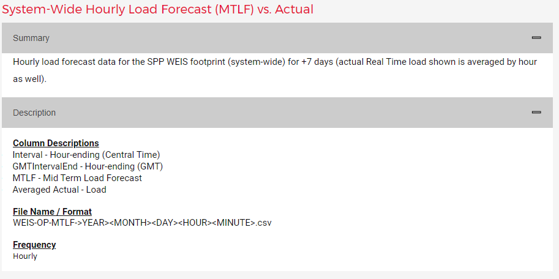

# SPP Weis

## Introduction
This is a POC project to build out a forecasting model using an MLOps lifecycle.

* Collect data
* Engineer data
* Train and evaluate models
* Version model
* Deploy model
* Monitor model

## Data
SPP market data is available at https://marketplace.spp.org/groups/operational-data-weis.  This data is public and updated on regular intervals.  An automated job will be set up to pull this data and store it in Databricks. This automation can be scheduled in Databricks or Posit, this project will test out both options to examine pros and cons.

## MLOps frameworks
We can test and compare [MLFlow](https://docs.databricks.com/mlflow/index.html) in Databricks and [Vetiver](https://vetiver.rstudio.com/) in Posit.

## Model interactivity
Model interactivity will handled via a dashboard.  Possible dashboarding tools include [Streamlit](https://streamlit.io/) and [Shiny](https://shiny.posit.co/py/).  Dashboard functionality will include:

* Comparing historical forecasts to actuals
* Displaying performance metrics for model performance
* Allowing users to do what-if analysis by changing model inputs and making API calls

## Price forecasting
All of the data to build a price forecasting model is available from SPP.  For the price model we need a load forecast and a forecast of renewable energy generation.  [Here](https://pricecontourmap.spp.org/pricecontourmapwest/) is the price contour map for the Weis.

* Locational marginal prices for settlement locations are available [here](https://marketplace.spp.org/pages/lmp-by-settlement-location-weis), this is the target data.  It contains 5 minute interval data updated every five minutes.  We'll aggregate this up to the hourly level for the purposes of the POC. We will use this data to test building a global forecasing for all of the price locations.\
[Example 5 minute data file](./data/WEIS-RTBM-LMP-SL-202306071210.csv)\

* Mid term load forecasts (MTLF) are available [here](https://marketplace.spp.org/pages/systemwide-hourly-load-forecast-mtlf-vs-actual-weis).  This is a Weis system wide hourly load forecast for the next 7 days (168 hours).  It also include acutal loads so it can be used to build out a history of actuals for model training.  This data is updated every hour.\
[Example data](./data/WEIS-OP-MTLF-202306071100.csv)\

* Mid term resource forecasts (MTRF) are available [here](https://marketplace.spp.org/pages/mid-term-resource-forecast-mtrf-weis).  This is a Weis system wide hourly forecast for solar and wind generation for the next 144 hours. The forecast is updated every hour and include recent actuals that can be used to build out a history of data.\
[Example data](./data/WEIS-OP-MTRF-202306071100.csv)\

## Forecasting tools
The [Darts](https://unit8co.github.io/darts/README.html) implements a consistent interface to many different forecasting models.  Included in the models are machine learning and deep learning.  This POC is a good canidate for these types of models given the non-linearities and multiple seasonalities included in the data.  We can also get confidence intervals and create global forecasting models.  The Darts interface allows us to include historical data, actuals we have recorded, as well as future data, like forecasted load and renewable energy generation.  Not every model supports these features, [here](https://unit8co.github.io/darts/README.html#forecasting-models) is a table showing what each model supports.  To get up and running with here are some examples:

* The [Quickstart](https://unit8co.github.io/darts/quickstart/00-quickstart.html?highlight=global#Machine-learning-and-global-models) contains a good overview and includes a section on global models.
* The [Temporal Fusion Transformer](https://unit8co.github.io/darts/examples/13-TFT-examples.html) has all of the features we need, historical and future data, as well as confidence intervals for forecasts.
* [Here](https://unit8co.github.io/darts/examples/01-multi-time-series-and-covariates.html) is an example of training using multiple series and transfer learning.
* [Here](https://unit8co.github.io/darts/examples/14-transfer-learning.html?highlight=global) is a longer example of transfer learning and global models.

## Project plan
The goal is to do incremental development and testing to for the entire MLOps lifecycle.  To that end, some work can be done in parallel and we may not move linearly through the cycle.  Steps 3 and 4 could be done in parallel. Here are the proposed steps:

1. Gather data from SPP [DATA-368](https://xecxt1.atlassian.net/browse/DATA-368)
    * Build out scripts locally to extract and load data for model training.
    * Set up processes to automate loading this data into data bricks.
    * Update existing data with the latest updated data from SPP, for example each hourly load forecast file may update the the past few hours of loads as revisions are made.  See this [documentation](https://docs.databricks.com/delta/merge.html) for upserting data into Databricks.
    * TODO:
        * set up upsert for single historical file (so it doesn't overwrite actuals with forecasts)
2. Build out a quick test model [DATA-369](https://xecxt1.atlassian.net/browse/DATA-369)
    * Test out global forecasting instead of local forecastin
    * Verify we have enough data to have a useful model
    * Test setting up an API
    * Get a feel for canidate models and good sets of hyper parameters
    * Understand computational needs for model training
3. Build out MLOps framework and evaluate possible tools [DATA-370](https://xecxt1.atlassian.net/browse/DATA-370)
    * Train and evaluate models
    * Version model
    * Deploy model
    * Monitor model
4. Build out user interface [DATA-371](https://xecxt1.atlassian.net/browse/DATA-371)
    * Comparing historical forecasts to actuals
    * Displaying performance metrics for model performance
    * Allowing users to do what-if analysis by changing model inputs and making API calls
    * Identify potential users and get iterative feedback from them

## Local project set up
For development work on our local Windows machines there are two scripts to help set up the environment and launch jupyter-lab.

* Run the [create_env.bat](./env/create_env.bat) to create the `spp_weis` conda environment.  The pakages needed for the project may be fluid to start as do the intial work so this environment will need to be occasionally updated.
* There is a convenience script in the scripts folder, [start_jupyter_lab.bat](./scripts/start_jupyter_lab.bat), to launch jupyter-lab locally.
* There is stub for a script to launch streamlit as well, [start_streamlit.bat](./scripts/start_streamlit.bat).

## Data format

See documentation:
* https://unit8co.github.io/darts/generated_api/darts.models.forecasting.tft_model.html
* https://unit8co.github.io/darts/generated_api/darts.models.forecasting.lgbm.html

 Historical and future covariates are declared in the fit function.  Input and output chunck lengths are declared in the constructors.

 
 
 